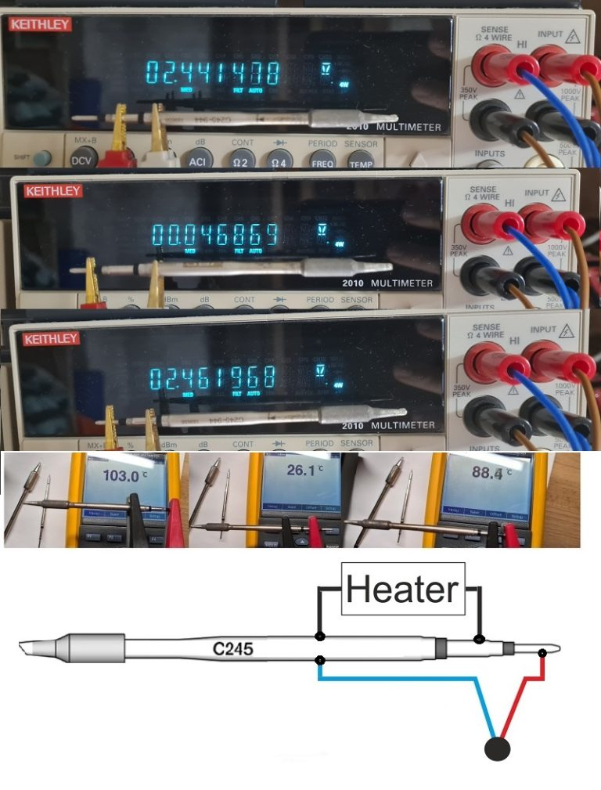
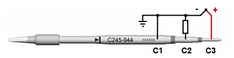
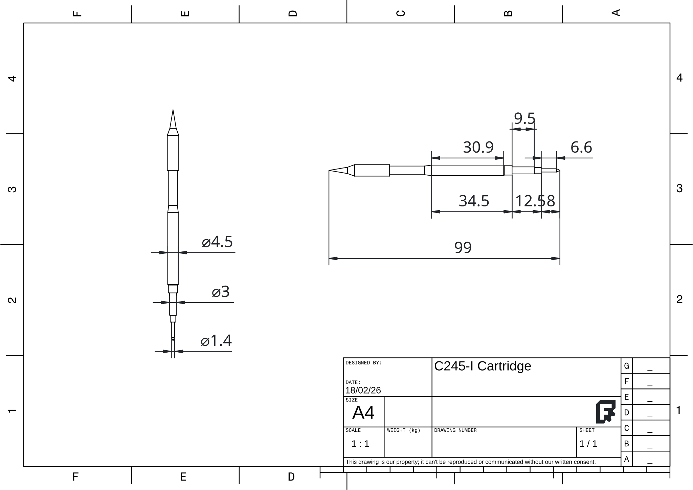
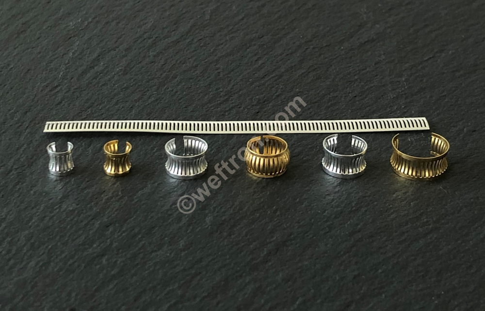
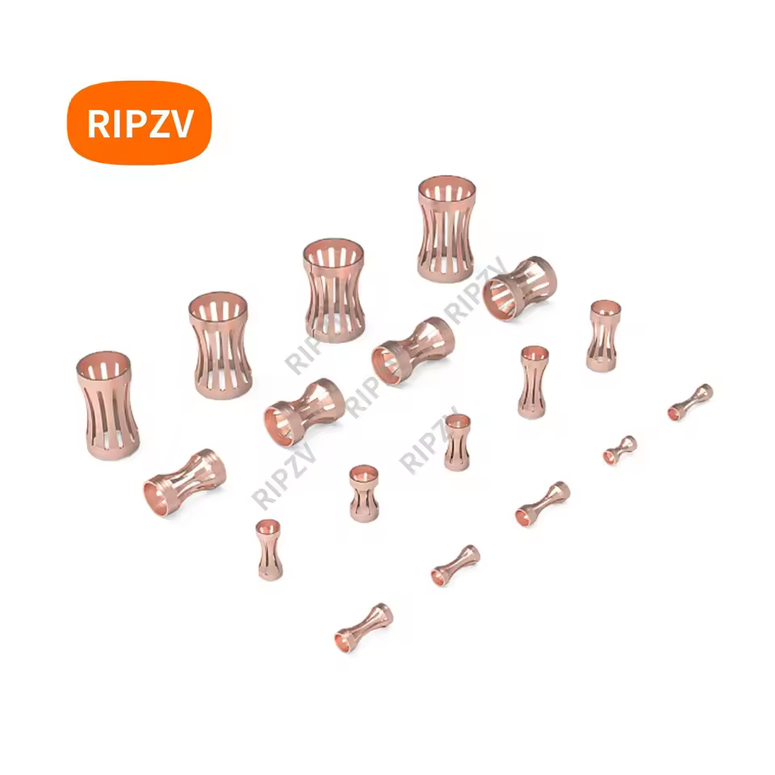
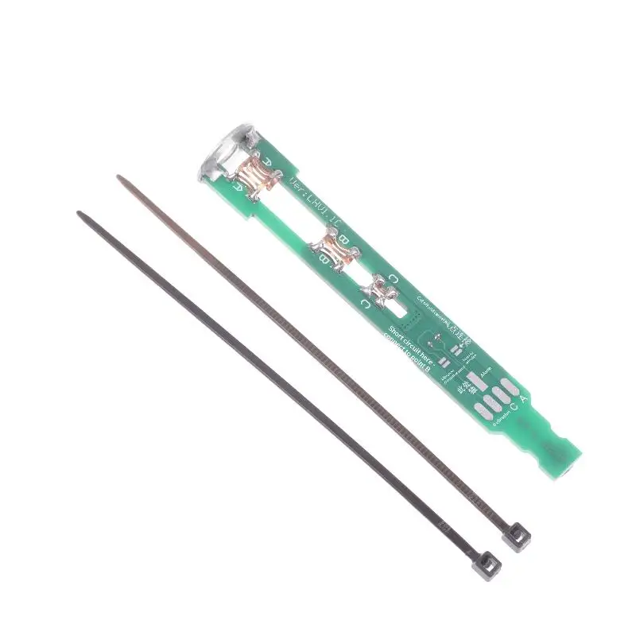
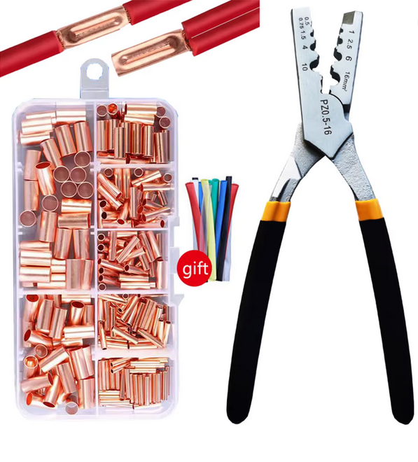

# Cartucce C245

La punta scelta è la [JBC C245](https://www.jbctools.com/c245-cartridge-range-long-life-tip-product-19-design-iron.html?srsltid=AfmBOopjGnkjXNlq-zEUu0ESfJj61yaCO3gkSN-VRrS08Abnxsk02of4), sono cartucce con integrata sia la resistenza che una termocoppia.
I motivi di questa scelta sono:

1. Sono punte molto comuni, sia nei saldatori USB-C che in stazioni compatibili.
2. Esistono vari cloni delle punte di marche cinesi, abbassando il costo all'utente.
3. Ci sono tanti diversi formati delle punte, da molto fine per SMD fino a scalpelli molto grandi.
4. Potenza massima di 130W, che è abbastanza alta per saldare quasi ogni cosa.

## Dettagli sulle Cartucce
[Taglio di una cartuccia](https://web.archive.org/web/20161018130611/http://bbs.38hot.net/thread-28591-1-1.html) originale, da un forum cinese, mostra i contatti e come è formata la termocoppia.

### Contatti
I contatti della punta sembrano essere [questi](http://adgd.ru/2021/01/04/jbc-soldering-cartridges-pinouts/). Non capisco però perchè diversi saldatori collegano la cartuccia in modo diverso.

La resistenza delle cartucce è di circa 2,5Ohm come si vede dalla foto, ma a seconda del tipo di punta e del produttore questo valore cambia molto, fino a 5Ohm per delle cartucce non standard.

Sul forum di eevblog ci sono vari thread che parlano di queste punte, [eccone uno](https://www.eevblog.com/forum/projects/jbc-handle-cartridge-data/25/) che parla della resistenza, contatti e specifiche della termocoppia. Uno [solamente sulla termocoppia](https://www.eevblog.com/forum/projects/how-do-soldering-tips-work-i-cannot-find-any-thermistor-or-thermocouple-inside/msg6109449/#msg6109449).

### Dimensioni
Vorrei dire che le ho dovute fare io grrr.

## Contatti per le Cartucce

Esistono diversi tipi di contatti, divesi manici usano diverse soluzioni, ma tutti i prodotti recenti sembrano usare dei [contatti a banda](https://en.wikipedia.org/wiki/Electrical_connector#Crown_spring_connectors) (crown spring, louverband, crown contacts, ...). Questi sono solitamente prodotti custom e costano parecchio in piccole quantità.
Alcuni prodotti e produttori:

- https://yifengxing.en.made-in-china.com/product/VJNYECxvvlUG/China-Stamping-Wire-Drum-Spring-Terminals-Connector-Copper-Terminal-Crimp-Wire-Terminal-Block-Hardware-Metal-Terminal.html
- https://www.alibaba.com/product-detail/Reida-3-0-8-0-Beryllium_1600460847915.html
- https://it.aliexpress.com/item/1005006737028553.html
- https://www.te.com/en/product-192046-6.html
- https://www.te.com/en/product-1-192004-4.html
- https://it.aliexpress.com/item/1005009010705644.html
- https://it.aliexpress.com/item/1005010642796548.html
- https://www.joyelectric-china.com/insulation-components-for-gis/insulation-parts-and-accessories/louvered-contact-bands.html
- https://globetech.jp/products/contact-bands
- https://eu.mouser.com/c/connectors/?series=Louvertac&pg=2
- https://www.digikey.it/en/products/filter/backplane-connectors/backplane-connector-contacts/335?s=N4IgrCBcoA5QnAGhDOkBMYC%2BWg

Un modo per ottenere questi contatti è di cannibalizzarli dagli handle per le stazioni jbc, basta cercare "jbc handle c245" su aliexpress e si trovano diversi manici con contatti buoni. Un'altra fonte sono le schede per "DIY907", che sembrano essere schede di conversione da un saldatore 907 a cartucce C245:

Il costo al 18/02/2026 si aggirava attorno ai 2,30eur.

Una alternativa è di creare dei tubicini in rame, crimparli poco e magari farci qualche taglietto, come ha fatto [questo tizo](https://www.youtube.com/watch?v=pcxZdMfctsA), [altro link](https://www.pcbway.com/project/shareproject/Fully_Portable_Battery_Soldering_Iron_670303fe.html).
 [link aliexpress](https://it.aliexpress.com/item/1005006967338748.html)
