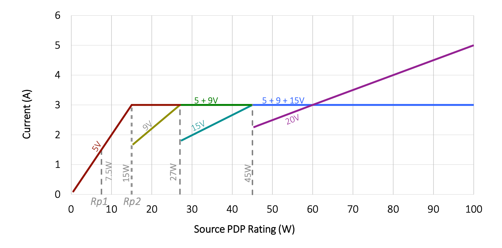
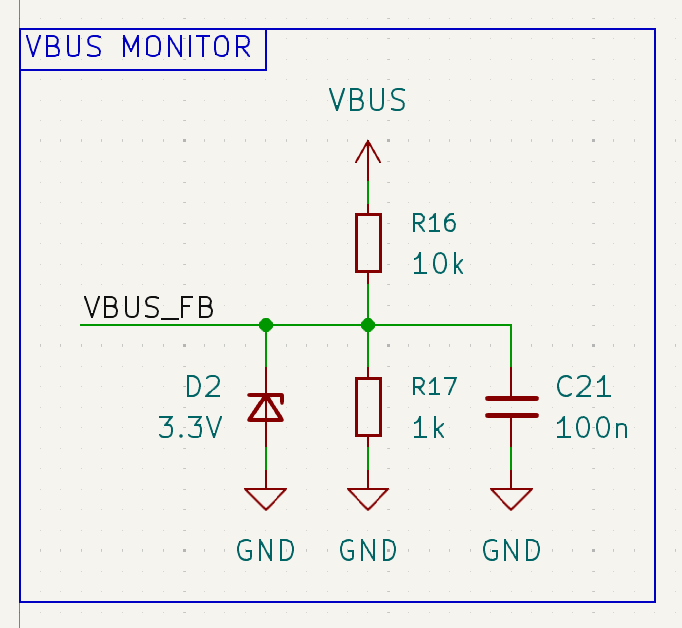
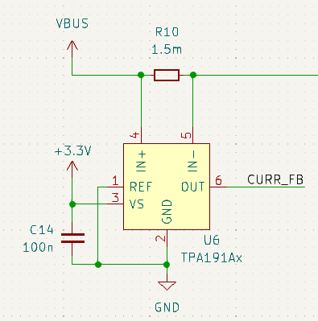
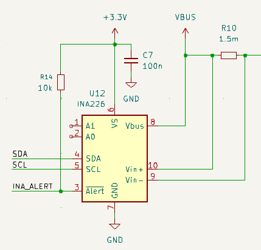
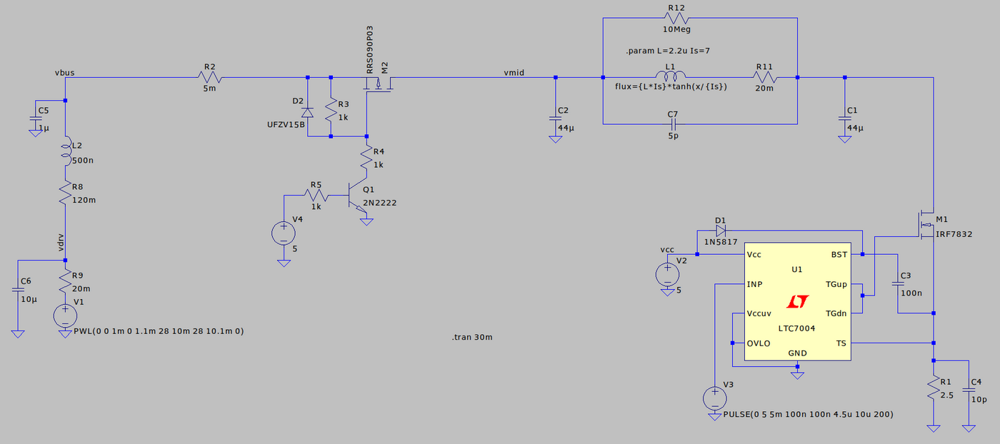
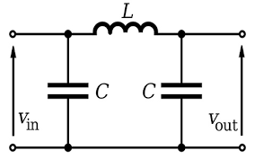

# Circuiteria di Potenza

La parte principale del saldatore è la parte di potenza.

## USB PD
Lo standard USB PD e EPR permette potenze di uscita fino a 280W, il problema è che l'aumento di potenza viene ottenuto solamente con un aumento di tensione, mantenendo la corrente massima a 5A:

Quindi per mantenere la potenza di ingresso al di sotto del rating dell'alimentatore è necessario mantenere la corrente al di sotto dei 5A, superare i 5A (o poco più) manderebbe l'alimentatore in protezione spengendolo.
La maggior parte dei saldatori commerciali USB non hanno nessun tipo di filtraggio, invece usano diversi trucchi:

1. Punte non standard a 5Ohm, come il [Sequre S99](https://sequremall.com/products/sequer-s99-soldering-iron-support-pd-qc-dc-pps-power-supply-compatible-with-c245-tip-for-drone-rc-model-welding-repair-tool-anti-static-welding-pen?variant=42863253356732).
2. Switching molto veloce.
3. Limitano la tensione di ingresso per rimanere sotto al limite di corrente, limitando anche la potenza.
4. Se ne fregano il cazzo e sperano che l'alimentatore se ne freghi anch'esso.

## Monitoring della Potenza di Uscita

Tocca leggere sia la tensione che la corrente, per la lettura della tensione basta un partitore resistivo:

Mentre per la lettura della corrente conviene usare un monitor high-side, in modo da non disturbare la trensione di terra e quindi le misure della termocoppia. Questi amplificatori devono essere fatti apposta per sopportare la tensione a modo comune alta, pari alla tensione di alimentazione.

Questo tipo di monitoring si può fare in diversi modi:

1. Con un amplificatore operazionale discreto, ma questo porta il numero di componenti ad almeno 5, contando condensatore di bypass e resistenza di uscita sono 7.
2. Con un integrato con uscita di corrente come lo [ZXCT1109](https://www.diodes.com/part/view/ZXCT1109), che però ha una uscita in corrente che per essere letta correttamente dovrebbe essere bufferata.
3. Con un integrato con uscita in tensione come lo [TPA191](https://static.3peak.com/res/doc/ds/Datasheet_TPA191.pdf), in questo caso non serve resistenza di gain e basta attaccarlo al pin di ADC del micro.
4. Usar un integrato con uscita digitale come lo [INA230](https://www.ti.com/lit/ds/symlink/ina230.pdf) o l'[INA226](https://www.ti.com/lit/ds/symlink/ina226.pdf), che integra sia il monitoring di tensione che quello di corrente, però il costo è molto più alto.

Analisi costo/area:

- INA226: 0.61 EUR, solo area di un MSOP-10, non poca ma tutto in uno.
- TPA191 + 1k.1% + 10k.1% + Zener: 0.57 EUR, area 3x0603+SOD-323+SOT-23-6, leggermente maggiore ma migliore flessibilità sul piazzamento.

Per evitare di comprare altri componenti e aumentare inutilmente il costo dell'ordine è meglio usare il [INA226](https://www.ti.com/lit/ds/symlink/ina226.pdf) o il suo equivalente [TPA626](https://www.lcsc.com/product-detail/C5761471.html). Inoltre questi integrati permettono di impostare alert per la sovraccorrente o sovratensione.

## Mosfet e Filtro Pi

Quello che importa è avere una corrente costante dal lato di ingresso, siccome la punta è un carico resistivo mi importa poco se riceve picchi di tensione e corrente. Per questo motivo il modo più semplice di smussare la corrente al lato di ingresso è di usare un [filtro PI](https://resources.altium.com/it/p/pi-filter-designs-power-supplies):

La frequenza di taglio del filtro PI è la solita di un filtro LC:
$$
f_0 = \frac{1}{2\pi\sqrt{L\ 2C}}
$$
Allora per ottenere il comportamento desiderato la frequenza di switching della punta deve essere almeno una decade sopra questo valore.
$$
L=2.2\mu \text{H},\ C=44\mu \text{F} \\ f_0 = 11.4\text{kHz}
$$
La frequenza di switching va anche valutata in base alle perdite di switching sul mosfet.

A differenza di [altre soluzioni](#altre-soluzioni), un filtro di questo tipo è di bassissima complessità e non richiede un particolare controllo, l'importante è usare la giusta frequenza di switching e limitare la potenza alla punta per garantire che la corrente rimanga nel limite. 

### Scelta dell'Induttore

Le specifiche principali dell'induttore per questa applicazione sono:

- Dimensione, la scheda è in alcune sezioni di 10mm di larghezza, quindi sarebbe meglio tenersi sotto i 6x6mm.
- ESR (Equivalent Series Resistance), ci dice quanto dissiperà l'induttore, inversamente proporzionale a dimensione e all'induttanza.
- Corrente di saturazione, la corrente per la quale il core dell'induttore satura, superare questa corrente riduce l'induttanza effettiva e scalda il core.
- Corrente di riscaldamento, la corrente per cui l'induttore comincia a scaldarsi sopra una certa temperatura se l'aria è a 25 gradi, ci dice la resistenza termica del package.

Alcuni induttori considerati, in **bold** quelli buoni:
| **MODELLO** | **VALORE** | **DCR** | **PACKAGE** |
| --- | --- | --- | --- |
| [XAL6060-103MEC](https://www.lcsc.com/product-detail/C5329540.html) | 10u | 27m | 6.6x6.4 |
| [XRFWHP0660A-100M](https://www.lcsc.com/product-detail/C51913009.html) | 10u | 30m | 6.6x6.4 |
| [AAPS0660M100F](https://www.lcsc.com/product-detail/C49261494.html) | 10u | 30m | 6.6x6.4 |
| [XRFWHP0660A-4R7M](https://www.lcsc.com/product-detail/C51913007.html) | 4.7u | 15m | 6.6x6.4 |
| [APH0660C-4R7M-TCD5](https://www.lcsc.com/product-detail/C50326286.html) | 4.7u | 15m | 6.6x6.4 |
| [AAPS0660M4R7F](https://www.lcsc.com/product-detail/C49261490.html) | 4.7u | 15m | 6.6x6.4 |
| [APS0660M4R7F](https://www.lcsc.com/product-detail/C49261301.html) | 4.7u | 15m | 6.6x6.4 |
| **[FC-ALX 4030D-2R2MT](https://www.lcsc.com/product-detail/C5370906.html)** | **2.2u** | **11m** | **4.2x4.2** |
| [MTQH404030S2R2MBT](https://www.lcsc.com/product-detail/C50345893.html) | 2.2u | 23m | 4.2x4.2 |
| [PSTMAA4030-2R2MG](https://www.lcsc.com/product-detail/C45385247.html) | 2.2u | 22m | 4.2x4.2 |
| [XRIM404030S2R2MGCA](https://www.lcsc.com/product-detail/C39846868.html) | 2.2u | 19m | 4.2x4.2 |
| [FC-ALX 5030D-3R3MT](https://www.lcsc.com/product-detail/C5370911.html) | 3.3u | 17m | 5.3x5.1 |
| [FC-ALX 5030D-2R2MT](https://www.lcsc.com/product-detail/C5370910.html) | 2.2u | 12m | 5.3x5.1 |

### Scelta dei Condensatori

[Derating](https://www.microtype.io/blog/dc-bias-effect-in-ceramic-capacitors) per DC bias.
[Modelli](https://product.tdk.com/en/technicalsupport/tvcl/general/mlcc.html) fatti bene della TDK. [Modelli](https://www.chemi-con.co.jp/en/faq/detail.php?id=How2LTspice) della Chemicon.

### Corrente di Inrush
### MOSFET e Driver

La scelta dei mosfet è fondamentale per ridurre la potenza dissipata, per semplificare il sistema ho scelto di usare uno [switching high-side](https://techweb.rohm.com/product/power-device/switches/23727/), mentre per ridurre le perdite sul mosfet ho deciso di usare un canale N. 
I mosfet canale N hanno resistenza di canale minore e minore carica di gate, quindi permettono di minimizzare sia le perdite di conduzione che le perdite di commutazione. Il problema è che usare un mosfet a canale n in configurazione high side richiede un driver fatto apposta.

Le perdite a causa della conduzione del mosfet si calcolano con l'espressione:
$$
P_\text{cond} = \frac{I^2}{R_{\text{DS}_\text{on}}} D
$$
Dove $I$ è la corrente che scorre nel mosfet quando acceso, approssimabile come $I=V_\text{BUS}/R_\text{tip}$, $T$ è il periodo di commutazione e $D$ è il duty cycle.

    NOTA: si arriva ad una espressione migliore se si considera che pure D dipende dalla potenza che voglio alla punta

Mentre la potenza persa durante la commutazione è stimabile come:
$$
P_\text{SW} = \frac{I\ V_{\text{BUS}}\ t_{\text{SW}}\ f}{2}
$$
Dove $t_\text{SW} = t_r + t_f$ è la somma del tempo di commutazione alto e basso del mosfet, si ricava dalla corrente di uscita del driver e dalla carica di gate del mosfet.

Lista di MOSFET canale n buoni:
|**MODELLO**|**VDS**|**RDSon**|**Qg**|
|---|---|---|---|
|[AGM6014AP](https://www.lcsc.com/product-detail/C6719405.html)|60|4.3m|33n|

Lista di driver buoni e non:
| **LINK** | **NOTE** | **PACKAGE** | **DIODO BOOT** |
| --- | --- | --- | --- |
| https://www.lcsc.com/product-detail/C5795658.html | half bridge, consigliato per notebook e quindi tensione minore | dfn 2x2 |  |
| https://www.lcsc.com/product-detail/C116731.html | half bridge per buck | dfn 2x2 |  |
| https://www.lcsc.com/product-detail/C892859.html | half bridge per buck | dfn 2x2 |  |
| https://www.lcsc.com/product-detail/C606336.html | half bridge per buck | dfn 3x3 |  |
| https://www.lcsc.com/product-detail/C533032.html | low-side ma anche high-side con configurazione strana, input differenziale | sot 23 |  |
| https://www.lcsc.com/product-detail/C5481755.html | high e low-side per mosfet SiC, input differenziale e configurazione strana | sot 23 |  |
| https://www.lcsc.com/product-detail/C964602.html | half bridge per buck | dfn 2x2 | interno |
| https://www.lcsc.com/product-detail/C2677203.html | logica 5V | sot 23 | esterno |
| **[IRS10752LTRPBF](https://www.lcsc.com/product-detail/C126923.html)** |  | sot 23 | esteno |
| [IRS20752LTRPBF](https://www.lcsc.com/product-detail/C495818.html) |  | sot 23 | esterno |
| [IRS25752LTRPBF](https://www.lcsc.com/product-detail/C538346.html) |  | sot 23 | esterno |
| **[NSG10752](https://www.lcsc.com/product-detail/C41414522.html)** | pin-compatible con quelli infineon | sot 23 | esterno |
| https://www.lcsc.com/product-detail/C603811.html | half-bridge per buck, discontinuato | dfn 2x2 | interno |
| https://www.lcsc.com/product-detail/C603810.html | half bridge per buck, versione di replacement per NCP81161 | dfn 2x2 | interno |
| https://www.lcsc.com/product-detail/C2677131.html | half bridge per buck | dfn 3x3 | interno |
| https://www.lcsc.com/product-detail/C41414473.html | half bridge per buck | dfn 3x3 | esterno |
| https://www.lcsc.com/product-detail/C154581.html | half bridge per buck | dfn 3x3 | interno |

Il problema dei driver selezionati è che hanno una UVLO molto alta (10V) che quindi richiede un buck ulteriore per alimentarli, aumentando il costo e numero dei componenti.

## Altre Soluzioni

## Altri Saldatori

È comodo confrontare altri saldatori USB-C e vedere come funzionano.

### Pinecil V2
Link alla [wiki](https://wiki.pine64.org/wiki/Pinecil), [schema elettrico](https://files.pine64.org/doc/Pinecil/Pinecil_schematic_v2.0_20220608.pdf).

### Alientek T80P
[Teardown](https://www.reddit.com/r/soldering/comments/1cm03vg/jbc_style_usb_soldering_iron_roundup_teardown/ ), [issue di IronOS](https://github.com/Ralim/IronOS/issues/1945) con foto e lista componenti.

### Miniware TS21
[Teardown](https://www.reddit.com/r/soldering/comments/1kho3lc/miniware_ts21_disassemble/), [issue di IronOS](https://github.com/Ralim/IronOS/issues/2122) con componenti.

### Sequre S60P
[Teardown](https://community.element14.com/technologies/test-and-measurement/b/blog/posts/usb-c-soldering-iron-quick-review-sequre-s60) e dettagli dei componenti, [discusione su IronOS](https://github.com/Ralim/IronOS/discussions/1806).